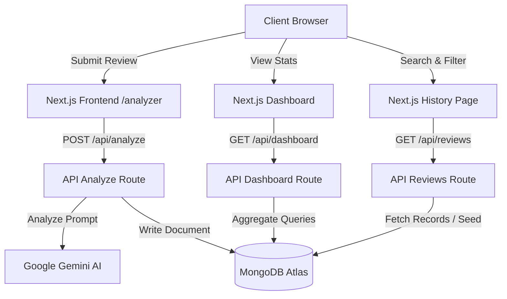

# ReviewLens AI: Project Summary Report

## 1. Project Overview

**ReviewLens AI** is an AI-powered customer review analysis and response generation platform designed for businesses in the hospitality and service industries (such as hotels, lodges, and restaurants). The application automates the process of reading guest reviews, identifying customer sentiments, classifying feedback topics (categories), and drafting professional, context-appropriate replies.

By leveraging Google Gemini AI and MongoDB database persistence, ReviewLens AI allows management teams to gain structured insights into operations and maintain high levels of engagement with guests.

---

## 2. System Architecture

The project is built on Next.js using the App Router, combining responsive client-side pages with backend API routes and databases.



### Key Architectural Layers:
1. **Frontend Presentation**: Responsive, nature-inspired forest-green custom styled interface utilizing Tailwind CSS, Lucide React icons, and Recharts.
2. **Serverless API Routes**: Next.js API endpoints (`/api/analyze`, `/api/reviews`, `/api/dashboard`) that handle backend logic, validate input, interface with Gemini AI, and perform database transactions.
3. **AI Services**: Service layer built on `@google/generative-ai` that communicates with the `gemini-1.5-flash` model using structured prompt engineering to guarantee structured responses.
4. **Database persistence**: MongoDB Atlas accessed through the Mongoose Object-Data Mapper (ODM), utilizing a cached connection pattern to optimize performance in serverless functions.

---

## 3. Database Schema Design

ReviewLens AI uses a single collection to store analyzed reviews. The schema is designed for speed, flexibility, and easy aggregation.

### Mongoose Schema: `Review`

| Field | Type | Required | Validation / Enum | Description |
| :--- | :--- | :---: | :--- | :--- |
| `reviewText` | `String` | Yes | `minlength: 10` | The original review text submitted by the guest. |
| `sentiment` | `String` | Yes | `Positive`, `Neutral`, `Negative` | Categorized sentiment of the review text. |
| `category` | `String` | Yes | `Food`, `Cleanliness`, `Location`, `Host`, `Value`, `Experience` | Primary focus category of the feedback. |
| `aiResponse` | `String` | Yes | Max length validation | The auto-drafted reply written by Google Gemini. |
| `createdAt` | `Date` | Yes | Default: `Date.now` | The timestamp when the review was analyzed. |

---

## 4. Core Features

- **Dynamic Review Analyzer**: Interactive form where users input feedback. It calls the Gemini API to instantly return classification badges and a draft response with a one-click clipboard copying mechanism.
- **Analytics Dashboard**: Aggregated summary charts including:
  - **Sentiment Breakdown**: A colorful Pie Chart representing the proportion of Positive, Neutral, and Negative sentiments.
  - **Category Frequencies**: A Bar Chart detailing reviews per topic area (e.g. food quality, host behavior, room cleanliness).
  - **Key Metrics**: Dynamic statistics cards counting total records.
- **Review Database (History) with Search & Filter**:
  - Full catalog of reviews sorted by date.
  - **Instant Search**: Matches text across guest comments and AI draft responses.
  - **Filters**: Instant dropdown filters for category and sentiment.
  - **Sorting**: Flexible sorting for newest or oldest entries.
  - **Expandable Cards**: Click-to-expand details view containing the full text and response copy button.

---

## 5. Key Challenges & Solutions

### Challenge 1: Connection Overhead in Serverless Functions
**Problem**: In serverless environments like Vercel, API routes are executed on-demand in ephemeral containers. Creating a new Mongoose/MongoDB connection on every request causes high latency, connection pool exhaustion, and performance bottlenecks.
**Solution**: Implemented a MongoDB connection caching singleton pattern in `src/lib/mongodb.ts`. The database connection promise is stored on the global Node namespace, allowing subsequent API invocations on hot containers to reuse the existing database connection.

### Challenge 2: Ensuring Clean AI Outputs
**Problem**: LLMs can sometimes output conversational preambles (e.g., *"Here is your analysis:"*) or wrap code blocks in markdown fences (` ```json `), which breaks parsing when extracting sentiment, category, and draft reply attributes.
**Solution**: Engineered a robust system prompt in `src/lib/gemini.ts` instructing the Gemini model to respond exclusively with a raw JSON object string conforming to a predefined structure. Added regex and JSON parsing try-catches with fallback heuristics to guarantee the application doesn't crash on anomalous model outputs.

### Challenge 3: Chart Hydration Mismatches
**Problem**: Recharts relies heavily on client-side screen sizes and SVG measurements, causing Server-Side Rendering (SSR) hydration warnings or layout shifts in Next.js.
**Solution**: Wrapped all dashboard charts in a custom React state check (`isMounted`), rendering charts only on the client-side after mounting is complete.
